# 🏦 Credit Risk — Loan Default Prediction


> **End-to-end ML pipeline** สำหรับทำนายความน่าจะเป็นที่ลูกค้าจะเกิด **90-day delinquency** ภายใน 2 ปี โดยเปรียบเทียบ 3 algorithms และเลือกตัวที่ดีที่สุดด้วย Cross-validation + SHAP explainability

**Author:** Kantinan Sukkert | Risk Officer, BAAC  
**Project:** Module 5 — ML Pipeline Assignment  
**Dataset:** [Give Me Some Credit (Kaggle)](https://www.kaggle.com/competitions/GiveMeSomeCredit)

---

## 🎯 Business Problem

ธนาคารต้องการ **scoring model** ที่:
1. ทำนายความน่าจะเป็นที่ลูกค้าจะ default ภายใน 2 ปี
2. **อธิบายเหตุผล** ได้ (regulatory requirement — BOT/Basel III)
3. มี discriminatory power ระดับ **Gini ≥ 0.4** (BOT minimum standard)
4. รัน inference ได้เร็ว สำหรับ real-time decisioning

---

## 🏆 Key Results

| Metric | Value | Industry Standard |
|---|---|---|
| **ROC-AUC** | **0.871** | > 0.80 = Good |
| **Gini Coefficient** | **0.742** | > 0.70 = Excellent ✨ |
| **KS Statistic** | **0.589** | > 0.50 = Very Good |
| **CV Mean AUC** | **0.864 ± 0.004** | Stable across folds |

> 🏆 **Winner: Random Forest** — significantly better than Logistic+Lasso and LightGBM (p < 0.001)

---

## 📊 Dataset Overview

| Property | Value |
|---|---|
| Source | Give Me Some Credit (Kaggle) |
| Samples | 150,000 customers |
| Original Features | 10 |
| Engineered Features | 25 |
| Target | `SeriousDlqin2yrs` (default within 2 years) |
| Class Imbalance | 1:14 (6.68% default rate) |
| Imbalance Level | 🟠 Moderate |

---

## 🛠️ Tech Stack

- **Language:** Python 3.11.9
- **Core:** pandas, numpy, scikit-learn
- **ML:** LightGBM, XGBoost (optional), imbalanced-learn
- **Explainability:** SHAP
- **Visualization:** matplotlib, seaborn
- **Environment:** VS Code Jupyter Extension

---

## 📂 Project Structure

```
CreditRisk/
├── data/                              # Raw data from Kaggle
│   ├── cs-training.csv                # 150K samples with target (gitignored)
│   ├── cs-test.csv                    # Test set (gitignored)
│   ├── sampleEntry.csv                # Kaggle submission template
│   └── Data Dictionary.xls            # Feature descriptions
│
├── notebook/
│   └── 01_loan_default.ipynb          # 🎯 Main pipeline (14 cells)
│
├── report/                            
│   ├── figures/                       # 19 visualization outputs
│   ├── models/
│   │   └── BEST_MODEL_random_forest.pkl   # Trained model
│   └── results/                       # CSV / Parquet artifacts
│
├── .gitignore
├── README.md
└── requirements.txt
```

---

## 🚀 Quick Start

### 1. Clone Repository

```bash
git clone https://github.com/Kitty9079/Peem_Kaggle_DS.git
cd Peem_Kaggle_DS
```

### 2. Download Dataset

📥 ดาวน์โหลดจาก [Kaggle](https://www.kaggle.com/competitions/GiveMeSomeCredit/data) แล้ววางไฟล์ใน `data/`:
- `cs-training.csv`
- `cs-test.csv`
- `sampleEntry.csv`

### 3. Setup Environment

```bash
# Create virtual environment
python -m venv .venv

# Activate
.venv\Scripts\activate          # Windows
# source .venv/bin/activate     # Mac/Linux

# Install dependencies
pip install -r requirements.txt
```

### 4. Run Notebook

```bash
jupyter notebook notebook/01_loan_default.ipynb
```

หรือเปิดด้วย **VS Code Jupyter Extension**

### 5. Use Trained Model

```python
import joblib

# Load pre-trained model
model = joblib.load("report/models/BEST_MODEL_random_forest.pkl")

# Predict probability of default
default_prob = model.predict_proba(X_new)[:, 1]
```

---

## 🔬 Methodology

### Pipeline Overview

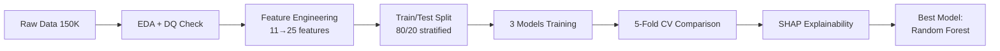

### 1️⃣ Exploratory Data Analysis (EDA)

ผมตรวจพบ **data quality issues** สำคัญ:

| Issue | Count | Action |
|---|---|---|
| `debt_ratio > 1` overlaps with income missing | 79.4% | → สร้าง `flag_income_missing` |
| `past_due ∈ {96, 98}` special code | 269 (54.65% default rate!) | → สร้าง `flag_special_code` |
| `age < 18` data errors | 14 | → Remove |
| `rev_util > 1` outliers | 3,321 | → Winsorize @ 1.0 |
| `monthly_income` missing | 19.82% | → Impute by age_bin median |

### 2️⃣ Feature Engineering (11 → 25 features)

**5 Binary Flags** (จาก EDA insights):
- `flag_credit_maxed` — rev_util ≥ 0.95
- `flag_any_past_due` — เคยค้างชำระ (lift 3.33x)
- `flag_special_code` — special code marker (lift 8.18x ⭐)
- `flag_income_missing` — รายได้ไม่ระบุ
- `flag_income_zero` — รายได้ 0

**3 Derived Features:**
- `total_past_due` — รวมประวัติค้างชำระทั้งหมด
- `debt_per_credit_line` — หนี้ต่อบัญชี
- `income_per_dependent` — รายได้ต่อคนพึ่งพิง

**2 Log Transforms:** `monthly_income_log`, `debt_ratio_log`  
**Age binning:** one-hot encoded into 5 buckets

### 3️⃣ Models Trained

| Model | Hyperparameters | Strategy |
|---|---|---|
| **Logistic Regression + Lasso (L1)** | `C=0.1`, `class_weight='balanced'` | Interpretable baseline + feature selection |
| **Random Forest** | `n_estimators=300`, `max_depth=10`, `class_weight='balanced'` | 🏆 Non-linear + interactions |
| **LightGBM** | `lr=0.03`, `scale_pos_weight=7`, with threshold tuning | Gradient boosting |

### 4️⃣ Evaluation Strategy

- **80/20 Stratified train/test split**
- **5-fold StratifiedKFold CV** (ตรวจ stability)
- **Industry metrics:** ROC-AUC, Gini, KS, PR-AUC
- **Paired t-test** สำหรับ statistical significance
- **SHAP** สำหรับ explainability

---

## 📈 Results

### Test Set Performance

| Metric | Logistic+Lasso | **Random Forest** 🏆 | LightGBM |
|---|---|---|---|
| ROC-AUC | 0.8665 | **0.8708** | 0.8693 |
| Gini | 0.7330 | **0.7417** | 0.7385 |
| KS | 0.5797 | 0.5885 | **0.5918** |
| F1 | 0.3383 | 0.3621 | **0.4507** |
| Recall | **0.7691** | 0.7581 | 0.4948 |

### Cross-Validation (5-fold)

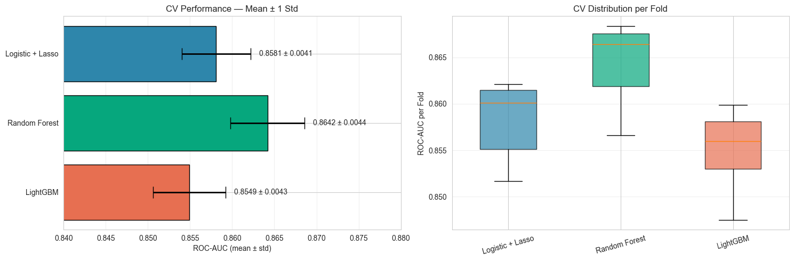

| Model | Mean AUC | Std | Stability |
|---|---|---|---|
| Logistic + Lasso | 0.8581 | ±0.0041 | 🟢 Excellent |
| **Random Forest** | **0.8642** | ±0.0044 | 🟢 Excellent |
| LightGBM | 0.8549 | ±0.0043 | 🟢 Excellent |

**Statistical test (paired t-test):**
- RF vs LR: p < 0.0001 ✅ Significant
- RF vs LGB: p < 0.0001 ✅ Significant

### ROC + Precision-Recall Curves

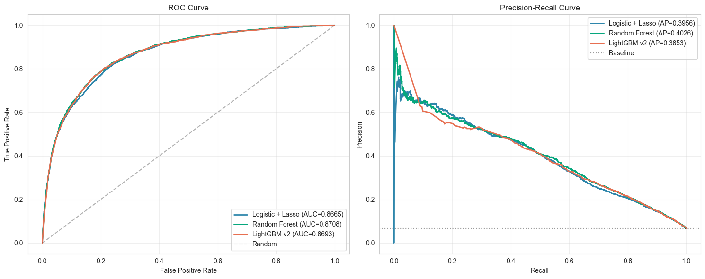

---

## 🔍 Explainability (SHAP)

### Global Feature Importance

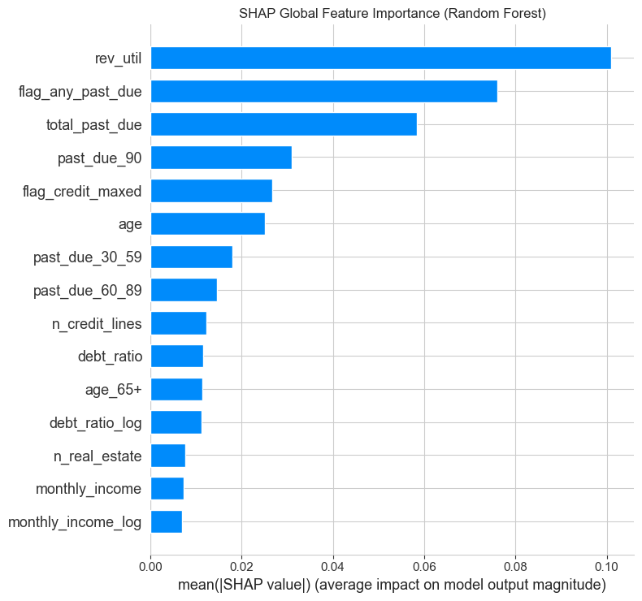

**Top 5 Risk Drivers:**
1. **`rev_util`** — credit utilization ratio
2. **`flag_any_past_due`** — past delinquency history
3. **`total_past_due`** — cumulative delay frequency
4. **`past_due_90`** — severe delinquency
5. **`flag_credit_maxed`** — maxed-out credit warning

### Feature Impact Distribution

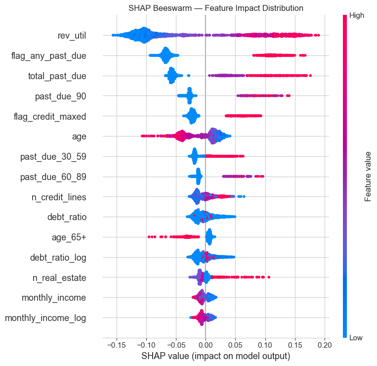

**Insights:**
- 🔴 **High rev_util** → strong push toward default
- 🔵 **Older age** → strong push toward safety
- 🚨 **Past delinquency** → binary jump (+0.18 SHAP gap)

### Dependence Plot — Non-linear Pattern

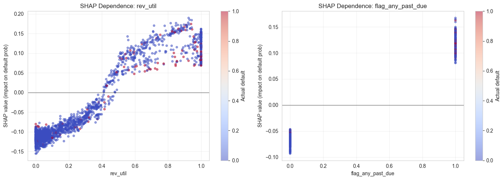

**Key finding:** `rev_util` shows **S-shape curve** — risk jumps after 0.5  
→ Business rule: **rev_util > 0.5 = elevated risk zone**

---

## 🎨 Visualization Gallery

<details>
<summary>📊 EDA Plots</summary>

### Feature Distributions
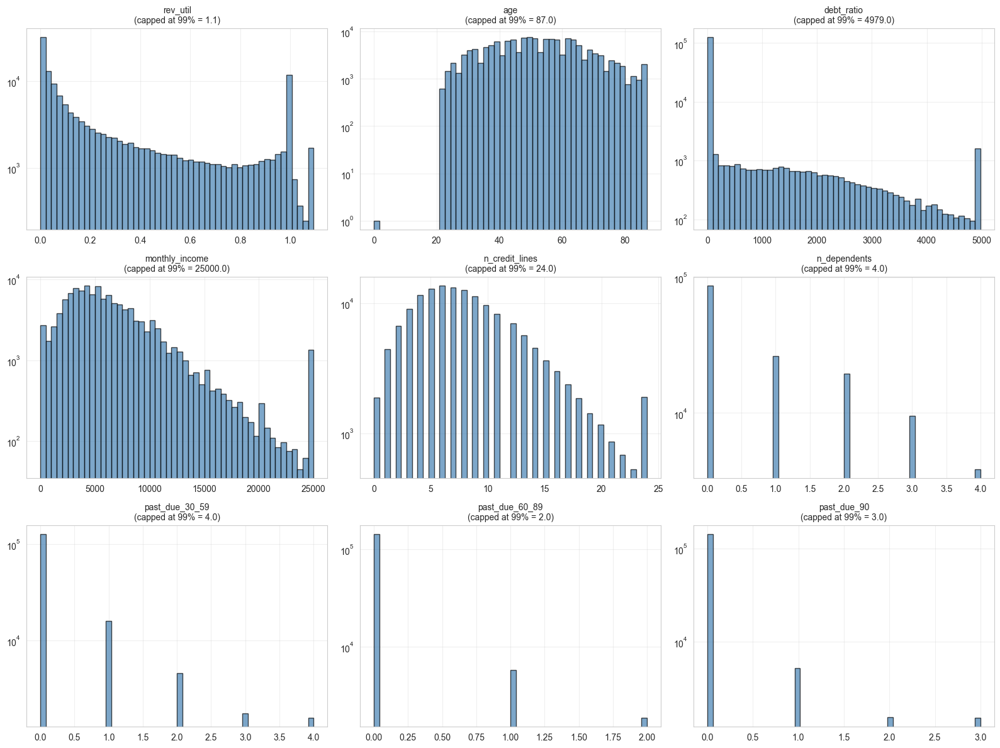

### Default Rate by Feature Bins
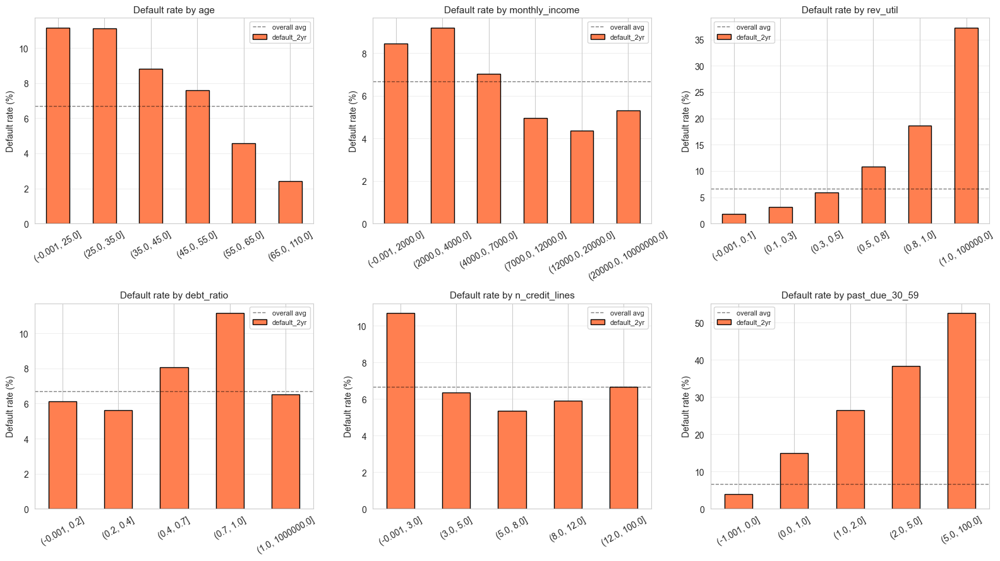

### Correlation Heatmap
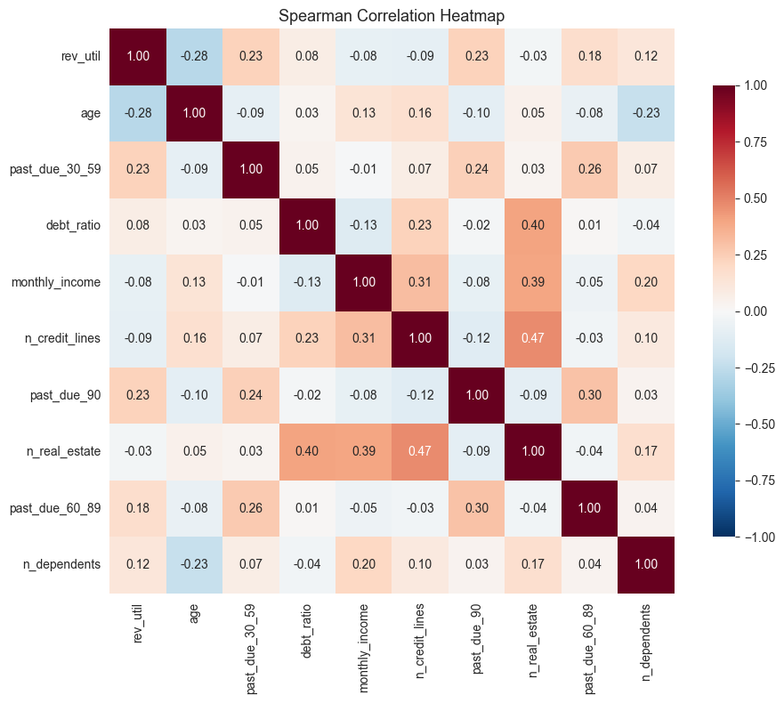

### Mutual Information
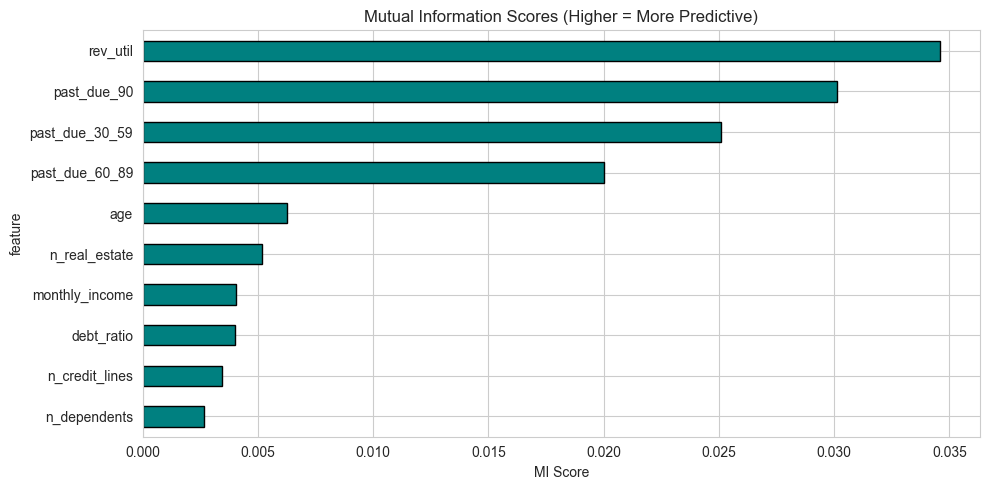

</details>

<details>
<summary>🤖 Model Performance</summary>

### Logistic Regression Coefficients
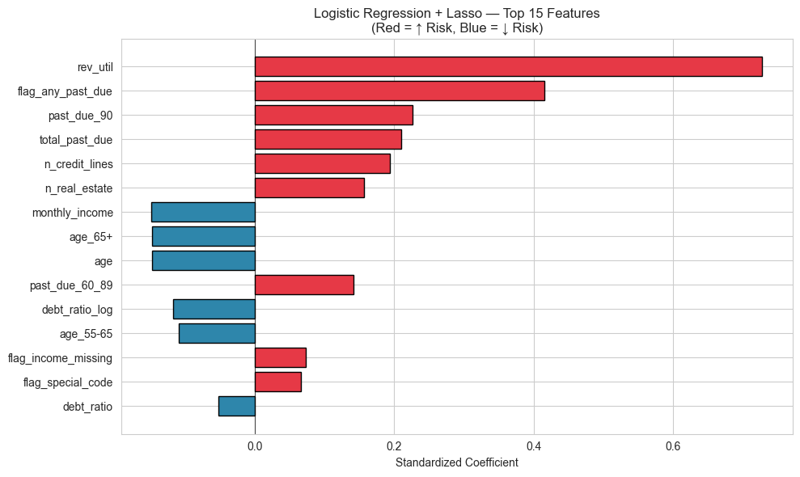

### Random Forest Feature Importance
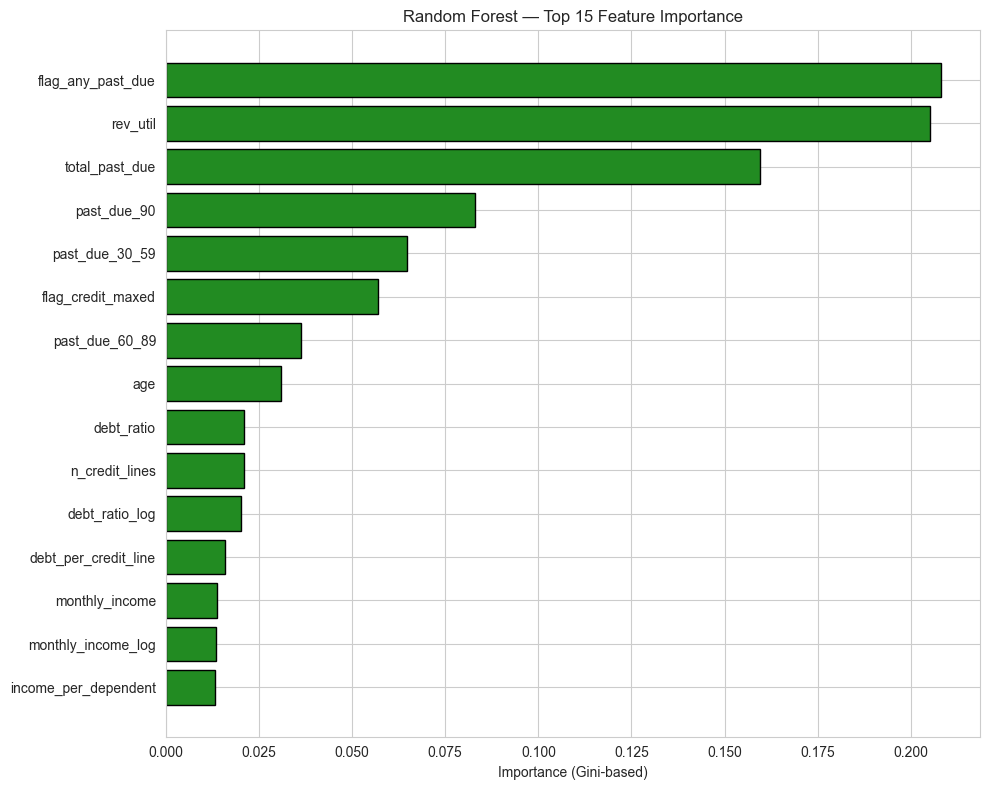

### LightGBM Feature Importance
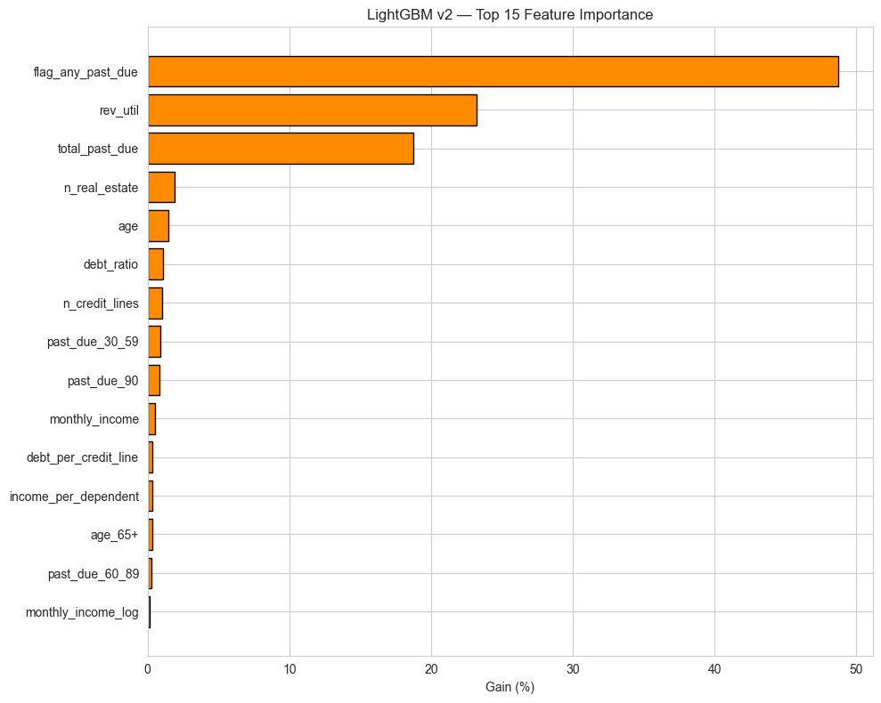

### Threshold Tuning (LightGBM)
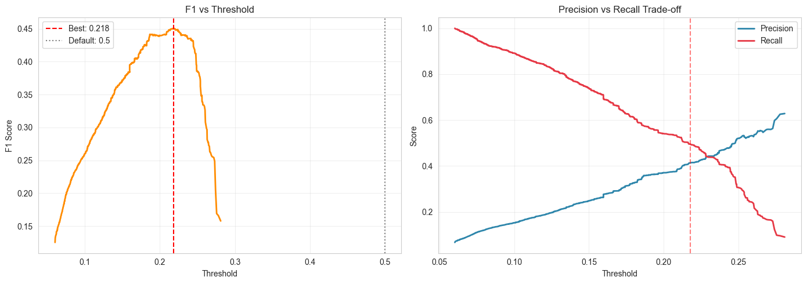

</details>

---

## 💼 Business Application (BAAC)

โมเดลนี้สามารถนำไปใช้เป็น **Credit Scorecard** ได้จริง:

### Risk Tiering
```python
RISK_ZONES = {
    "🟢 Low Risk":     "default_prob < 0.10",
    "🟡 Medium Risk":  "0.10 ≤ default_prob < 0.30",
    "🟠 High Risk":    "0.30 ≤ default_prob < 0.50",
    "🔴 Critical":     "default_prob ≥ 0.50",
}
```

### Use Cases
1. **Pre-approval screening** — กรองลูกค้าเสี่ยงสูงตั้งแต่ต้น
2. **Pricing adjustment** — ดอกเบี้ยตามระดับความเสี่ยง
3. **Portfolio monitoring** — ติดตามคุณภาพพอร์ตสินเชื่อ
4. **Early warning system** — เตือนล่วงหน้าก่อน default
5. **Capital reserve calculation** — IFRS9 PD model

---

## 📊 Industry-Standard Metrics

| Metric | Achieved | BOT Guideline | Status |
|---|---|---|---|
| Gini | **0.742** | > 0.40 (minimum) | ✅ **Excellent** |
| ROC-AUC | **0.871** | > 0.80 (good) | ✅ Pass |
| KS | **0.589** | > 0.30 (acceptable) | ✅ Very Good |
| CV Stability | **±0.004** | < 0.01 (stable) | ✅ Pass |

> 💡 **Model พร้อมส่ง regulatory review** ตามมาตรฐาน BOT

---

## ⚠️ Limitations

1. **No macroeconomic variables** — โมเดลไม่รวมตัวแปร macro (GDP, unemployment)
2. **No behavioral data** — ไม่มี transaction history, payment patterns
3. **Static features only** — ใช้ snapshot ไม่ใช่ time-series
4. **No hyperparameter tuning** — ใช้ค่า default, ยังพัฒนาได้
5. **Domain transferability** — train จาก US data, อาจไม่ตรง 100% กับลูกค้า BAAC

---

## 🔮 Future Work

- [ ] **Hyperparameter tuning** ด้วย Optuna (น่าจะดัน AUC > 0.88)
- [ ] **Stacking ensemble** (RF + LGB + XGB)
- [ ] **Time-series features** — Rolling averages, trends
- [ ] **Macroeconomic overlay** — ปรับ PD ตามสภาวะเศรษฐกิจ
- [ ] **Calibration** — Platt scaling / Isotonic regression
- [ ] **Model monitoring** — Drift detection, performance tracking
- [ ] **REST API deployment** — FastAPI + Docker

---

## 📚 References

1. He, H., & Garcia, E. A. (2009). Learning from imbalanced data. *IEEE Transactions on Knowledge and Data Engineering*, 21(9), 1263-1284.
2. Lundberg, S. M., & Lee, S. I. (2017). A unified approach to interpreting model predictions. *NeurIPS*.
3. Bank of Thailand. (2020). *Guidelines for Internal Rating Systems*.
4. Basel Committee on Banking Supervision. (2006). *Basel II Framework*.

---

## 👤 Author

**Kantinan Sukkert**  
Risk Officer | Bank for Agriculture and Agricultural Cooperatives (BAAC)  
M.M. (Finance), College of Management Mahidol University (CMMU) | GPA 3.88, Dean's List

- 📧 Email: kantinant2011@gmail.com
- 💼 LinkedIn: [linkedin.com/in/kantinan](https://linkedin.com)
- 🔗 GitHub: [@Kitty9079](https://github.com/Kitty9079)

---

## 📜 License

This project is for educational purposes only.  
Dataset © Kaggle / Give Me Some Credit Competition.

---

⭐ **If this project helped you, please star the repo!**